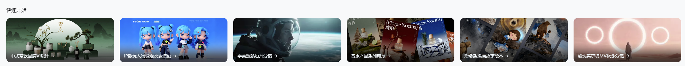

https://jimeng.jianying.com/ai-tool/assets-canvas?enter_from=ai_feature&from_page=explore&ai_feature_name=agentic

生成一个超现实梦境主题的分镜，共 8 个画面： 1. 半埋在流沙中的巨大破碎石膏头像，人物身着驼色帽衫长袍驻足观望。 2. 三个大小不一的环形光环面向镜头悬浮在沙漠上空，人物站在正中心 3.残破的古典廊柱与拱门在空中失重漂浮，人物站在画面正中心。 4.人物悬浮于倒置的沙丘建筑群中，建筑呈现中心对称结构 5.夜空变为深海，一头灰白色巨鲸缓缓游过沙丘。 6.数百座纯白石膏像无重力状态漂浮在沙漠上方。 7. 沙漠长出半透明的珊瑚，顶端有柔和的橙粉色光芒，人物站在正中心 8.一座通往云端的纯白螺旋阶梯，他在上面孤独地攀登。 画面风格： 以暖赭粉色为主基调，低饱和度，冷色仅用于远景阴影。主光为柔和的橙粉色体积光，形成温暖的边缘高光。整体对比度低、噪点颗粒细腻、影调柔和。 光线带有轻微雾化与长曝光光晕；空气中可见漂浮尘粒。镜头略有轻微晃动，远景呈极深景深。 焦段约 35mm，透视感强；体积雾增强空间层次。 颗粒约 10%，画面具备写实质感。 LUT： 暖赭粉雾去饱和 —— 主色为赭红、沙粉、淡橙，辅以深蓝灰阴影；高光偏金，整体柔和且梦幻。 使用图片 3.0 生成，比例为 16:9

生成8张插画故事绘本分镜，9比16比例，保持角色一致性，全部画面统一色调。叙事张力，讲述女孩遇到熊之后，熊带着女孩翻山越岭的梦幻故事，毛茸茸，厚厚柔软的毛发，巨大的棕熊，小小的身穿灰蓝色衣服的女孩，鲜明笔触，现代写意线条，治愈感，北欧画风童话绘本，北欧峡湾冰川景观，画面场景统一低饱和棕灰高级色调，灰蓝色点缀，低对比度，柔光漫射感，情感温馨，手绘笔触，细腻水彩层次，4个分镜需要大远景留白，高级构成感。

Agent的提示词遵循以下格式，不要自行增删信息，可替换xx指代的内容： 保持参考图中风格、排版、形象、原图比例（3比4）生成： 背景为顶部深x到底部浅x渐变色调，高级低饱和、暗调沙龙配色，香水瓶“Florae Noctis”放在xx上，xx下是带xx的xxx。周围有xx、xx、xx装饰，左侧是xx，前方摆着1-2颗xx。上方大标题“{Florae Noctis} ”，注意拼写不要出错。大标题可以与场景内的植物有局部穿插，但背景保持留白美感，大标题下方为中文2字标题，底部白色文字“HERBARIUM”，所有中文标题可根据画面意境替换调整，保持诗意高级表达。 2. 优先使用4.0模型生图 3. 保持对参考图的排版、构图、画面复杂度的高度遵循和参考 4. 保持系列组图的构图、影调一致性

生成一个太空漫游主题的短片分镜，共 8 个画面： 1. 火箭发射升空，尾焰划破大气层。 2. 穿越云层的飞行镜头。 3. 巨大的星球在天空中缓慢移动。 4. 宇航员漂浮在空间站舷窗前，望向远方星海。 5.宇航员在零重力中漂浮，四肢舒展，背景是地球的弧线。 6. 飞船掠过行星环带。 7. 飞船外大批碎片在大气中坠落 8. 宇航员背对镜头，缓缓进入光芒中消失。 画面风格：以冷蓝色为主基调，低饱和度，边缘带轻微暖光，长曝光光晕与体积光效果。整体对比度低、噪点颗粒细腻；远景呈极深景深。色彩 LUT: teal–deepblue desat。镜头焦段约 20–35mm，透视感强，暖色边缘光勾勒轮廓，体积雾、长焦虚化效果，画面具备写实质感。 使用图片 3.1 生成。

生成3组图片，保持角色一致性，图片比例保持3比4。 第一组：4张半身像表情包，表情和动作幅度大，包括但不限于：生气、大笑、思考、害羞。 第二组：4张场景照，角色在购物、校园、旅游、运动场景里活动，造型动作、服装、表情可根据场景明显变化。 第三组：4张服装造型照，构图和蓝色发色保持一致，但表情、动作、服装风格（华丽晚宴、复古lolita、户外山系、毛绒大衣）、造型、发型差异巨大（盘发、双马尾、挑染高马尾、带毛线帽羊毛卷），高级点缀配色，视觉风格融合Y2K与潮玩设计风，偏态度感、虚拟偶像风格。 注意人物结构合理性和场景搭配逻辑

青岚 品牌包装展示。海报画面充满了东方韵味的氛围。背景是高级绿色调，营造出一种中式茶韵味的感觉，极简风格品牌VI设计展示，以绿色为主色调，“青岚”采用精致复古宋体字的笔画装饰。 先生成茶叶礼盒、茶叶罐、手提袋、纸杯、茶饮杯、名片、香薰蜡烛、线香等品牌延展物的单张拍摄效果，比例为 3:4。 再生成整批物料在一个画面的展示图，包含茶叶礼盒、茶叶罐、茶包，纸杯、手提袋、杯垫、卡片、菜单、香薰蜡烛、线香、茶壶、茶杯，每个产品有秩序的陈列在一起，下方有着一个太湖石展台和茉莉花。背景是绿色弥散渐变，呈现统一的品牌标识与风格，专业的品牌视觉氛围 ，突出产品多样性与品牌一致性，背景干净 ，契合茶叶品牌包装定位，实景拍摄，比例 21:9。 使用图片 3.1 生成。

