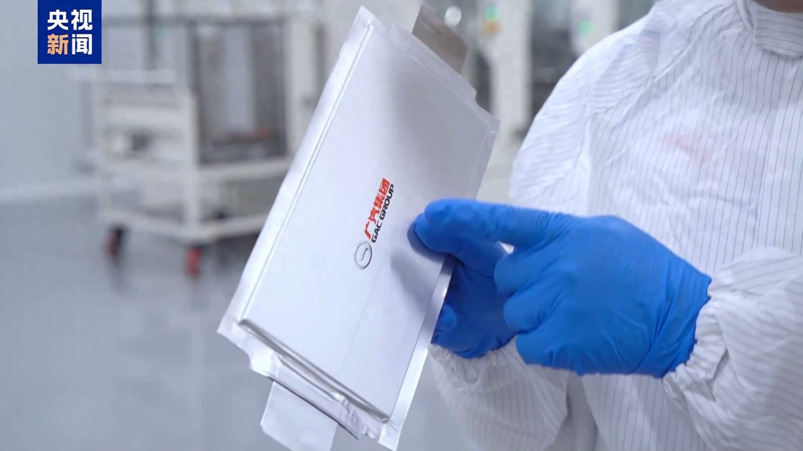
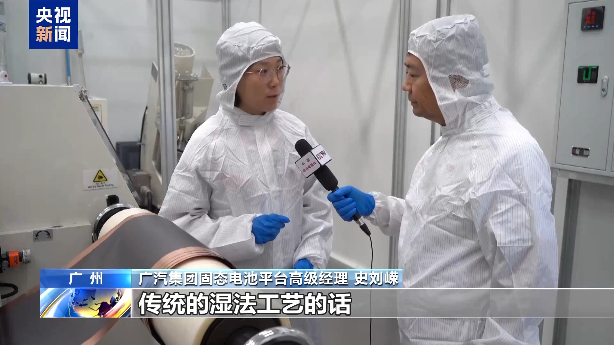
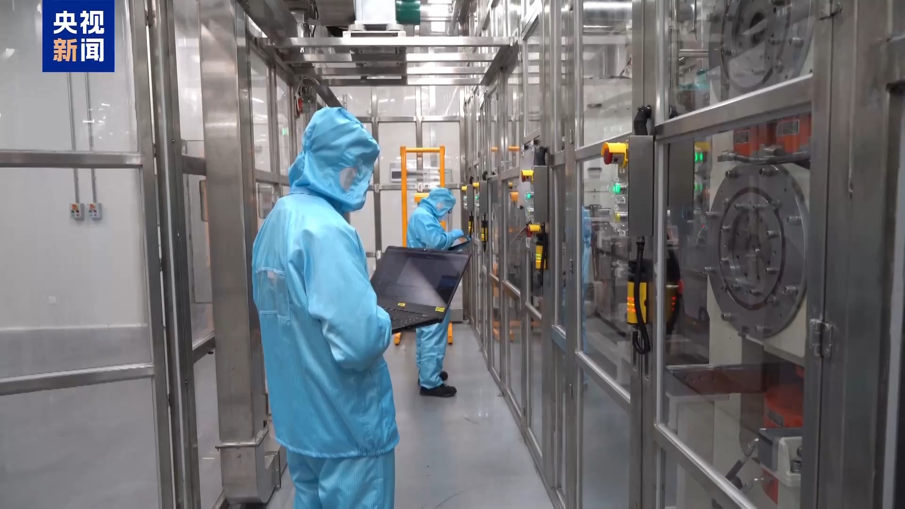
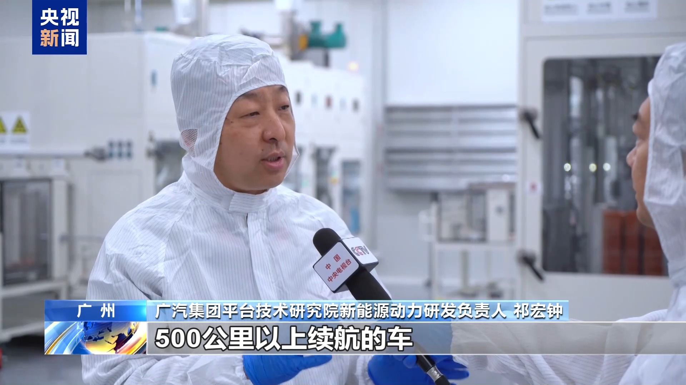

最近，一则“国内首条大容量全固态电池产线建成”的消息冲上热搜，阅读量短短几小时突破12万。评论区里，有人欢呼“油车彻底凉了”，也有人调侃“先别急，等车企清完库存再捡漏”。但在这波热闹背后，一个更值得深思的问题是：为什么全固态电池被称为电动车的“终极答案”？它真能一举解决续航短、充电慢、安全隐患多的痛点吗？

事实上，固态电池的突破远非“技术升级”那么简单。它更像一场能源存储技术的“基因改造”——用固态电解质取代传统液态电解液，让电池从“易爆的汽油桶”变成“稳定的砖块”。比如，国轩高科的全固态电池能量密度已达350Wh/kg，比主流液态电池高出40%，让电动车续航轻松突破1000公里。而更关键的是，固态电池彻底杜绝了电解液泄漏和燃烧风险，即使被钉子刺穿也能安然无恙。

但奇怪的是，产业界的态度却异常冷静。王传福直言“全固态电池量产仍需攻克界面阻抗等瓶颈”，广汽、长安等车企将大规模装车时间定在2026-2027年。这透露出一个残酷真相：技术突破只是起点，从实验室走向街头，固态电池还要闯过成本、工艺、供应链三道“鬼门关”。

**1. 固态电池的“超能力”从何而来？**​

传统液态锂电池如同一个“装满易燃液体的玻璃罐”，依赖电解液导电，但高温或碰撞易引发火灾。而固态电池将电解液替换为固态电解质，形成“三明治”般的稳定结构。这种设计不仅阻断了燃爆路径，还大幅压缩了电池内部空间，使能量密度倍增。例如，清华大学研发的新型固态电池能量密度已达604Wh/kg，约为现有电池的3倍。

更颠覆的是，固态电池可能重塑整个能源应用场景。在低温环境下，液态电池电量会“缩水”30%，而固态电池在-30℃仍能保持80%以上性能，这让电动直升机、极地科考设备成为可能。孚能科技甚至已为人形机器人定制固态电池，满足其高安全、高能量的需求。

**2. 产业化的“马拉松”：谁在领跑？谁在掉队？**​

尽管实验室捷报频传，但规模化量产才是真正的赛点。目前全球主流企业选择“三步走”策略：

- **半固态电池打头阵**：作为过渡方案，半固态电池（电解液含量5%-10%）已率先上车。例如，上汽MG4的半固态电池车型价格下探至10万元以内，试图打开大众市场。
    
- **全固态分路线竞争**：氧化物、硫化物、聚合物三条技术路线激烈竞逐。国内企业如国轩高科主攻氧化物路线，而日韩企业更倾向硫化物。
    
- **产能爬坡挑战巨大**：全固态电池的生产线与现有设备兼容度不足50%，需重建干法电极等新工艺。这也是为何宁德时代坦言“科学问题已解决，工程问题仍棘手”。
    

中国在专利布局上领先全球（专利申请超4.6万件），但日本丰田已积累1300项核心专利，试图在2027年实现全固态电池装车。这场竞争不仅是技术赛跑，更是专利与标准的争夺。

**3. 普通人的“受益时间表”**​

对于消费者而言，固态电池的普及将分阶段改变生活：

- **2025-2026年**：半固态电池优先用于高端电动车，续航突破1000公里，价格仍比同级车贵10%-20%。
    
- **2027-2030年**：全固态电池在飞行汽车、人形机器人等领域商用，电动车续航有望达1500公里，快充缩短至10分钟。
    
- **2030年后**：成本大幅下降，固态电池替代现有锂电池，电动车保值率暴跌，二手市场出现“捡漏机会”。
    

但需警惕的是，当前全固态电池成本是液态电池的3-5倍。若无法通过规模化将价格压至150美元/千瓦时以下，其商业化仍将受限。

固态电池的量产，更像电动车行业的一场“成人礼”。它意味着，电动车终于从“政策驱动”转向“技术驱动”，但这也对消费者提出了新挑战：是现在购入液态电池车型“抄底”，还是继续等待固态电池的“终极解决方案”？

事实上，技术迭代从未停止。正如一位业内人士所说：“固态电池不会颠覆液态电池，而是让它们在各司其职中共同进化。”未来5年，我们或将看到这样的场景：城市通勤车沿用性价比高的液态电池，而长途出行、高端车型由固态电池主导。这种“分层适用”的模式，才能真正推动能源革命的普惠化。

对于普通人而言，最好的策略是“保持关注，理性决策”。毕竟，技术的进步不是为了制造焦虑，而是让选择更具自由。当充电10分钟、续航1000公里成为常态，或许那时我们才会发现，电动车的竞争，才刚刚拿到决赛圈的入场券。