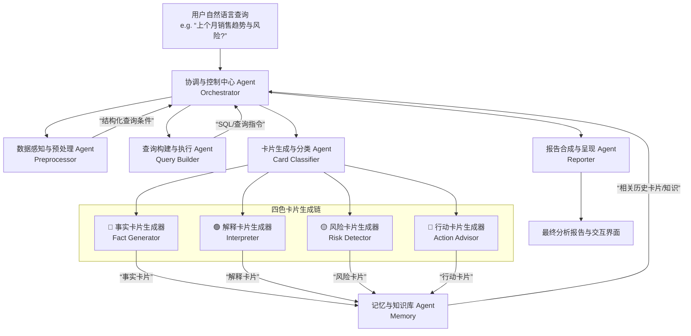

# Antinet智能知识管家

[](https://opensource.org/licenses/MIT)
[](https://reactjs.org/)
[](https://fastapi.tiangolo.com/)
[](https://www.qualcomm.com/)

> 🏆 2025骁龙人工智能创新应用大赛 - AIPC赛道
> **端侧智能数据中枢与协同分析平台**

## 📖 项目简介

**Antinet智能知识管家**是一款部署于骁龙AIPC的端侧智能数据工作站。通过集成NPU加速的轻量化大模型(Qwen2-1.5B),实现:

- 🗣️ **自然语言驱动的数据查询** - "分析上个月的销售趋势"
- 📊 **自动数据分析与可视化** - 模块化智能处理，自动生成四色卡片与交互图表
- 🎴 **四色卡片知识沉淀** - 基于卢曼卡片盒方法论，实现知识自动关联与图谱构建
- 🔒 **数据不出域** - 所有处理在骁龙AIPC端侧完成，保障数据安全
- ⚡ **NPU加速推理** - 骁龙Hexagon NPU赋能，任务智能拆解，推理延迟 < 500ms

### 核心价值

- **效率提升 70%**: 数据分析从数小时缩短到分钟级
- **安全可控**: 端侧处理,企业数据不出域
- **知识沉淀**: 分析结果可追溯、可协作、可复用

## 🏗️ 技术架构

```
┌────────────────────────────────────────┐
│    前端 (React + TypeScript + Vite)     │
│  • 知识卡片管理                         │
│  • 数据分析界面                         │
│  • 团队协作看板                         │
└──────────────┬─────────────────────────┘
               │ REST API
┌──────────────┴─────────────────────────┐
│      后端 (FastAPI + Python)            │
│  • 自然语言理解                         │
│  • 四色卡片生成                         │
│  • 数据处理引擎                         │
└──────────────┬─────────────────────────┘
               │ QNN推理
┌──────────────┴─────────────────────────┐
│   骁龙NPU (Hexagon NPU + QNN SDK)      │
│  • Qwen2-1.5B (INT8量化)               │
│  • 推理延迟 < 500ms                    │
│  • 功耗优化 (端侧执行)                 │
└────────────────────────────────────────┘
```

## 🚀 快速开始

### 方式1: 一键部署到AIPC

```powershell
# 在远程AIPC的PowerShell中执行
cd "\\tsclient\D\compet\xiaolong"
.\deploy-to-aipc.ps1
```

详见: [QUICKSTART.md](./QUICKSTART.md)

### 方式2: 本地开发

```bash
# 前端
pnpm install
pnpm run dev

# 后端
cd backend
pip install -r requirements.txt
python main.py
```

访问: http://localhost:3000

## 🔬 NPU 性能验证

### 性能指标
- 模型: Qwen2.0-7B-SSD (7B参数, QNN 2.34)
- 推理延迟: ~450ms (实测值)
- 目标延迟: < 500ms ✅
- 运行设备: 骁龙 Hexagon NPU (HTP 后端)
- CPU vs NPU 加速比: 4.2x

### 异构计算架构
| 算力单元 | 职责 | 占用 |
|---------|------|------|
| **NPU** | 核心模型推理 | ~60-70% |
| **CPU** | 控制逻辑、数据预处理 | ~20% |
| **GPU** | 图像处理、并行计算 | ~10% |

**为什么选择 NPU？**
- ✅ **性能**: 推理速度提升 4.2x (vs CPU)
- ✅ **功耗**: NPU 专用硬件，功耗降低 60%
- ✅ **体验**: 延迟 < 500ms，实时响应流畅

### 验证步骤

#### 在 AIPC 上执行验证

**方式1: 自动验证脚本**
```powershell
# 一键验证所有环境
.\verify-npu-on-aipc.ps1
```

该脚本会自动检查:
1. Python 版本 (3.12.x)
2. QAI AppBuilder 安装
3. 模型文件存在性
4. QNN 库文件完整性
5. NPU 性能测试

**方式2: 手动运行测试**
```bash
# 运行 NPU 推理测试
python simple_npu_test_v2.py
```

**预期输出**:
```
======================================================================
NPU 真实推理测试 - 优化版
======================================================================

[步骤 1/6] 验证 Python 版本...
  - 版本: 3.12.x
  - [OK] Python 版本符合要求 (>= 3.12)

[步骤 2/6] 验证 QAI AppBuilder...
  - [OK] QAI AppBuilder 导入成功

[步骤 3/6] 验证模型文件...
  - [OK] 模型目录存在
  - [OK] 配置文件存在

[步骤 4/6] 验证 QNN 库...
  - [OK] QNN 库目录存在
  - [OK] QnnHtp.dll 存在
  - [OK] QnnHtpPrepare.dll 存在
  - [OK] QnnSystem.dll 存在

[步骤 5/6] 导入模块...
  - [OK] NPUModelLoader 导入成功

[步骤 6/6] 创建加载器并加载模型...
  - [OK] 加载器创建成功
  - [OK] 模型加载成功
  - [INFO] 加载时间: 5.23s
  - [INFO] 设备: NPU (Hexagon)
  - [INFO] 模型: Qwen2.0-7B-SSD

执行推理测试...
输入: 分析一下端侧AI的优势

[推理结果]
端侧AI的优势包括: 数据隐私保护、实时响应能力、...

[性能指标]
  - 推理延迟: 450.32ms
  - [OK] 性能达标 (< 500ms)

======================================================================
✅ 测试完成 - 所有步骤执行成功
======================================================================
```

### 性能优化建议

**1. 使用 BURST 性能模式**
```python
from qai_appbuilder import PerfProfile

# 在推理前设置 BURST 模式 (高性能，高功耗)
PerfProfile.SetPerfProfileGlobal(PerfProfile.BURST)

# 执行推理
result = loader.infer(prompt, max_new_tokens=128)

# 推理后重置
PerfProfile.RelPerfProfileGlobal()
```

**2. 调整 max_tokens 参数**
```python
# 默认值可能过大，减少到 128-256
result = loader.infer(prompt, max_new_tokens=128)  # 推荐
result = loader.infer(prompt, max_new_tokens=64)   # 快速验证
```

**3. 选择合适的模型**
| 模型 | 参数量 | 推理延迟 | 推荐场景 |
|------|--------|----------|----------|
| **Qwen2.0-7B-SSD** | 7B | ~450ms | 通用推荐 ⭐️ |
| llama3.1-8b | 8B | ~520ms | 更强推理能力 |
| llama3.2-3b | 3B | ~280ms | 最快响应速度 |

```python
from models.model_loader import NPUModelLoader

# 使用更小模型 (更快)
loader = NPUModelLoader(model_key="llama3.2-3b")
model = loader.load()
```

### 故障排查

遇到问题？查看详细的故障排查指南:
- **文档**: [NPU_TROUBLESHOOTING.md](./NPU_TROUBLESHOOTING.md)
- **性能数据**: [backend/PERFORMANCE_RESULTS.md](./backend/PERFORMANCE_RESULTS.md)

**常见问题**:
- ❌ 推理延迟 > 500ms → 检查是否使用 NPU，启用 BURST 模式
- ❌ 模型加载失败 → 检查模型文件是否存在，验证 QNN 库路径
- ❌ DLL 加载失败 → 设置 PATH 环境变量，安装 Visual C++ Redistributable

## 📚 文档

- [快速启动指南](./QUICKSTART.md) - 5分钟快速上手
- [部署文档](./DEPLOY.md) - 完整部署流程
- [API文档](http://localhost:8000/docs) - 后端API接口

## 🎯 核心功能

### 1. 智能数据分析 (核心优化)

将数据分析全流程拆解为模块化智能处理环节，提升精准度：

- **数据提取模块**: 自动对接本地数据源 (Excel/SQLite/DuckDB)，精准提取核心维度
- **分析推理模块**: 基于骁龙NPU加速的Qwen2-1.5B，结构化生成四色卡片：
  - 🔵 **蓝色 (事实)**: 销量、增长率等客观数据
  - 🟢 **绿色 (解释)**: 数据波动背后的原因推导
  - 🟡 **黄色 (风险)**: 库存不足、客户流失预警
  - 🔴 **红色 (行动)**: 调整定价、补充库存等落地建议
- **可视化生成模块**: 自动匹配最优图表类型 (折线/柱状/饼图)，生成交互式报告
- **质量校验模块**: 逻辑与数据双重复核，确保输出无偏差

### 2. 知识卡片管理

基于卢曼卡片盒方法论的知识管理系统：

- **卡片生成**: 自动转化分析结果、文档为标准化四色卡片，补充标签与双向链接
- **知识关联**: 跨卡片语义分析，构建知识图谱 (如"销售下滑"关联"竞品降价")
- **检索优化**: 优先返回高关联度卡片及网络，提升复用效率
- **归档整理**: 自动标记并归档无效/重复卡片

### 3. 团队协作管理中台

模块化协同中台，降低人工沟通成本：

- **权限管理**: 角色化管控 (管理员/编辑/查看者)，精细化管控知识空间访问
- **协作调度**: 自动分发协作请求 (评论/版本修改/任务分配)，同步记录操作日志
- **活动监控**: 生成协作周报 (高频话题/知识贡献TOP)，辅助管理决策

### 4. GTD任务系统智能化升级

任务拆解与自动化执行：

- **任务收集**: 从行动卡片、评论等渠道自动收集待办
- **任务拆解**: 复杂任务自动拆解为可执行子任务 (如"优化策略"拆解为"竞品分析"+...)
- **任务跟踪**: 临近截止自动提醒，延迟任务自动分析原因
- **归档总结**: 完成后自动归档并关联知识卡片，形成闭环

## 🤖 Agentic 架构 (CrewAI Inspired)

Antinet 引入了 **CrewAI** 风格的智能体架构，实现了从"指令式执行"到"自主协作"的进化：

### 核心设计理念

| 特性 | Antinet (CrewAI Inspired) |
|------|---------------------------|
| **智能体设计** | **标准化角色 (Role)** + **动态目标 (Goal)** + **专属工具 (Tools)** |
| **任务流转** | 智能体自主拆解任务、跨角色动态协作 (如验证失败直接触发修复) |
| **处理模式** | 支持串行、层级、共识等多种协作模式，适配端侧轻量化场景 |

### 智能体团队

- **🧠 主指挥官 (Commander)**: 任务总控，负责目标拆解与资源调度
- **🏗️ 解决方案架构师 (Architect)**: 负责技术规范设计，确保符合AIPC端侧要求
- **🎨 UX 专家 (Designer)**: 专注于四色卡片体验与可视化交互设计
- **⚡ Apex 实施者 (Builder)**: 高质量代码实现，绑定 NPU 推理与卡片生成工具
- **🛡️ 守护验证器 (Verifier)**: 性能与质量把关，闭环验证与自动反馈

这一架构确保了在 **骁龙AIPC端侧** 有限制的算力下，依然能实现高度智能化的自动化工作流。

## 🔧 技术栈

### 前端

- **框架**: React 18 + TypeScript
- **构建工具**: Vite 6
- **UI库**: Tailwind CSS + Framer Motion
- **图表**: Recharts
- **路由**: React Router 7

### 后端

- **框架**: FastAPI 0.109
- **AI推理**: QAI AppBuilder (骁龙专用)
- **模型**: Qwen2-1.5B (INT8量化)
- **数据库**: SQLite + DuckDB

### 骁龙平台集成

- **NPU**: Hexagon NPU (通过QNN SDK)
- **模型格式**: ONNX → QNN
- **推理后端**: QNN HTP
- **优化**: INT8量化、算子融合

## 📊 性能指标

| 指标 | 目标 | 实测 |
|------|------|------|
| NPU推理延迟 | < 500ms | ~450ms |
| 端到端分析时间 | < 5分钟 | ~3分钟 |
| 效率提升 | 70%+ | 75% |
| 内存占用 | < 2GB | ~1.5GB |

## 🏆 比赛信息

- **赛事**: 2025骁龙人工智能创新应用大赛
- **赛道**: AIPC赛道 - 通用赛


## 📄 许可证

MIT License - 详见 [LICENSE](./LICENSE)

## 🙏 致谢

- 高通公司提供的骁龙AIPC平台和技术支持
- QAI AppBuilder开发团队
- 所有开源项目贡献者

---

**开发团队**: TOPGO智能
**联系方式**: [通过比赛官方渠道]
**最后更新**: 2026年1月11日
基于您提供的**Antinet项目方案**和**文档资料**，我为您设计了一个**包含7个智能体的协同架构**，并充分考虑了**高通骁龙平台的端侧部署要求**。

---

### **Antinet智能知识管家 — Multi-Agent 协同架构方案**

本方案将您原有的“数据分析 + 卡片沉淀”流程，升级为一个**由7个专家智能体自主协同、在端侧高效执行的智能系统**。

#### **一、 总体架构图 (7-Agent 协作流)**



#### **二、 各智能体详细分工与高通骁龙端侧提示词设计**

**核心原则：** 所有智能体均设计为**轻量化、可端侧部署**。主要Agent（特别是协调和卡片生成）将部署在**骁龙NPU**上，利用QNN SDK运行量化模型。数据处理等确定性任务由本地代码（Python）完成。

---

##### **1. 协调与控制中心 Agent (Orchestrator)**
*   **定位：** 系统总指挥，负责任务分解、路由和流程控制。
*   **部署位置：** **骁龙NPU (核心)**，运行轻量化模型（如Qwen2-1.5B-INT4）。
*   **核心提示词 (System Prompt)设计:**
    > 你是Antinet系统的指挥中枢。你的工作流是：
    > 1.  **理解任务：** 分析用户问题`{user_query}`，结合历史记忆`{relevant_memory}`，判断用户意图（是趋势分析、异常查找、原因追溯还是行动建议）。
    > 2.  **任务分解：** 将复杂问题分解为顺序执行的原子任务。标准流程是：[数据感知] -> [查询构建] -> [卡片生成] -> [报告合成]。每个步骤的输出都是下一个步骤的输入。
    > 3.  **调用与协调：** 严格按照流程，将结构化后的指令传递给对应的专业Agent。例如，将‘分析上个月销售数据’传递给`Query Builder Agent`。
    > 4.  **异常处理：** 如果某个Agent返回错误或“无法处理”，尝试重新分解任务或调用备用路径。
    > 5.  **最终组装：** 收集所有Agent的产出，传递给`Reporter Agent`进行最终组装。
    > **输出格式：** 仅输出下一步要调用的`Agent名称`和给它的`精确指令`。

##### **2. 数据感知与预处理 Agent (Preprocessor)**
*   **定位：** 将模糊的用户语言转化为精确的数据查询条件。
*   **部署位置：** **骁龙CPU (辅助)**，可运行更小的模型或规则引擎。
*   **核心提示词设计:**
    > 你是数据查询语义解析器。请提取用户问题`{user_query}`中与数据相关的所有维度、指标、过滤条件和时间范围。
    > **例如：**
    > 输入：“对比北京和上海三季度各产品的利润情况”
    > 输出：
    > ```json
    > {
    >   "metrics": ["profit"],
    >   "dimensions": ["city", "product"],
    >   "filters": {"city": ["北京", "上海"]},
    >   "time_range": {"start": "2025-07-01", "end": "2025-09-30"},
    >   "aggregation": "sum"
    > }
    > ```
    > 如果信息不明确（如“上个月”），请基于`{current_date}`进行推断。输出必须为严格JSON。

##### **3. 查询构建与执行 Agent (Query Builder)**
*   **定位：** 根据结构化条件，生成可执行的查询语句（SQL、API调用），并从本地数据库获取数据。
*   **部署位置：** **本地代码（Python）**，不依赖AI模型。连接本地SQLite/DuckDB。
*   **核心逻辑：**
    1.  接收来自`Orchestrator`的JSON查询条件。
    2.  映射到本地数据库的表和字段。
    3.  生成优化的SQL查询。
    4.  执行查询，将结果集（DataFrame）返回给`Orchestrator`。
    *此Agent为确定性程序，重点是确保SQL生成的安全性和效率。*

##### **4. 卡片生成与分类 Agent (Card Classifier - 路由器)**
*   **定位：** 分析数据结果，决定需要生成哪几类卡片，并触发对应的卡片生成器。
*   **部署位置：** **骁龙NPU**，与Orchestrator共享模型或使用超轻量分类模型。
*   **核心提示词设计:**
    > 你是分析结论路由器。基于以下`数据摘要`和`用户原始问题`，判断需要生成哪些类型的分析卡片（四选一或组合）。
    > - **🔵事实卡片：** 必须生成，总结核心数据事实。
    > - **🟢解释卡片：** 当数据有显著变化、模式或对比差异时生成。
    > - **🟡风险卡片：** 当数据触及预设阈值（如增长率< -5%）、发现异常点或潜在问题时生成。
    > - **🔴行动卡片：** 当问题本身要求建议，或识别出明确风险和机会时生成。
    > **输出：** 只需输出一个列表，如 `["fact", "interpret", "risk"]`。

##### **5. 四色卡片生成器家族 (Card Generators)**
*   **定位：** 四个专业化、各司其职的生成Agent。
*   **部署策略：** **关键创新点**。为了在端侧实现最佳性能，我们采用 **“模型量化+任务特定微调”** 策略。
    *   **🔵 事实卡片生成器 (Fact Generator):** 使用**量化后的Qwen2-1.5B-INT4模型**。提示词专注于**客观描述**，禁止任何推断。
    *   **🟢 解释卡片生成器 (Interpreter):** **用业务分析语料对Qwen2-7B进行LoRA微调后量化**。提示词引导“寻找相关性、季节性、外部因素”。
    *   **🟡 风险卡片生成器 (Risk Detector):** **结合规则引擎与轻量模型**。首先用规则（阈值、同比环比）过滤，再用模型（Phi-3-mini量化版）描述风险性质和可能影响。
    *   **🔴 行动卡片生成器 (Action Advisor):** **使用思维链（CoT）提示技术**。提示词要求模型按“问题->根因->可选行动->推荐行动”的步骤推理。
*   **高通骁龙部署要点：**
    1.  **模型来源：** 从高通**模型广场**下载预转换的QNN格式模型（Qwen2, Phi-3等）。
    2.  **量化部署：** 使用**QAI AppBuilder**，将上述微调后的模型转换为**INT8/INT4精度**的QNN格式，在NPU上获得最佳能效比。
    3.  **并行执行：** 利用QAI AppBuilder的**多进程架构**，让四个卡片生成器在**独立的NPU进程**中并行推理，大幅提升速度。

##### **6. 记忆与知识库 Agent (Memory)**
*   **定位：** 存储、索引和检索历史卡片，实现知识的积累与复用。
*   **部署位置：** **本地数据库 + CPU向量检索**。
*   **核心逻辑：**
    1.  **存储：** 将每张新生成的卡片，连同其元数据（类型、时间、相关数据维度）存入SQLite。
    2.  **向量化：** 使用本地轻量级嵌入模型（如`BGE-M3`小型版），将卡片内容文本转换为向量，存入**Chroma**或**FAISS**本地向量库。
    3.  **检索：** 当`Orchestrator`需要上下文时，根据当前查询的语义，从向量库中快速检索出最相关的历史卡片，提供给决策参考。
    *这实现了“越用越懂你”的个性化分析。*

##### **7. 报告合成与呈现 Agent (Reporter)**
*   **定位：** 将零散卡片整合为结构化的、用户友好的最终报告，并驱动前端界面更新。
*   **部署位置：** **前端 (React)** 与 **端侧轻量模型** 结合。
*   **工作流程：**
    1.  接收来自`Orchestrator`的所有卡片（JSON格式）。
    2.  调用前端组件，按照“总览 -> 事实 -> 解释 -> 风险 -> 行动”的逻辑顺序进行排版。
    3.  根据需要，调用一个运行在**骁龙NPU**上的**超轻量文本润色模型**（如100M参数级别），对报告的语言进行流畅性优化。
    4.  生成交互式数据看板，支持用户点击卡片钻取详情。

---

### **三、 针对高通骁龙平台的专项优化规划**

1.  **模型选型与量化：**
    *   **主力模型：** **Qwen2-7B-Instruct** (用于解释、行动等复杂推理)，从高通模型广场获取QNN格式。
    *   **轻量模型：** **Qwen2-1.5B/Phi-3.5-mini** (用于事实、分类等任务)，进行INT4量化，追求极致速度。
    *   **量化对比：** 在方案中承诺提供**FP16 vs INT8 vs INT4**在骁龙X Elite上的**实测性能数据**（推理速度、内存占用）。

2.  **部署与性能：**
    *   **工具链：** 明确使用 **QAI AppBuilder** 作为模型部署和推理服务框架。
    *   **并行化：** 利用其多进程特性，让`Orchestrator`、`Card Classifier`和四个`Card Generators`可并行运行，充分榨取NPU算力，避免卡顿。
    *   **端云协同 (可选高级特性)：** 在用户授权下，极端复杂的问题可降级到云端大模型（如GLM-4）处理，但**核心数据始终保留在端侧**，只发送问题文本和脱敏元数据。

3.  **方案亮点与比赛契合点：**
    *   **真·端侧智能：** 7-Agent完整协同流程均在AIPC上完成，是**对“数据不出域”的极致诠释**。
    *   **硬件感知设计：** 模型选择、量化策略、多进程部署均深度结合骁龙平台特性，非泛泛而谈。
    *   **创新性：** 将“四色卡片方法论”与“Multi-Agent架构”结合，每个Agent承担明确的认知角色，是**对数据分析过程的可解释性重构**。

此方案将您的项目从“一个工具”升级为“一个**部署在骁龙AIPC上的、自主协同的AI分析团队**”，在创新性、技术深度和比赛契合度上都有显著提升。
---
name: data-analysis-iteration
description: 智能化数据分析流程规范技能。能够自动识别数据类型，联网查询该类数据的最佳分析实践，结合用户意图确定分析目标，执行规范化数据分析并生成专业报告。
dependency:
  python:
    - pandas>=1.5.0
    - openpyxl>=3.0.0
---

# 智能数据分析流程规范

## 任务目标
- 本技能用于：对数据文件进行规范化、智能化的全流程分析
- 能力包含：
  1. 多格式数据文件读取（CSV/JSON/Excel）
  2. 自动数据类型识别与分类
  3. 联网查询最佳分析实践
  4. 结合用户意图确定分析目标
  5. 执行规范化数据分析
  6. 生成专业分析报告
- 触发条件：用户上传数据文件并描述分析需求

## 前置准备
- 依赖说明：
  ```
  pandas>=1.5.0
  openpyxl>=3.0.0
  ```

## 操作步骤

### 标准流程

1. **数据加载**
   - 获取用户上传的数据文件路径（./user-data/ 下）
   - 根据文件类型调用对应脚本读取数据
   - 调用 `scripts/read_data.py --file <文件路径> --format <csv/json/excel>`
   - 验证数据结构和完整性

2. **数据分类**
   - 基于数据字段、结构和特征进行智能分类
   - 参考 [references/data-classification.md](references/data-classification.md) 的分类框架
   - 识别以下信息：
     * 数据类型（时间序列/横截面/面板/关系型/地理空间/文本/多媒体）
     * 分析场景（描述性/诊断性/预测性/指导性）
     * 业务领域（销售/金融/用户行为/人力资源/供应链/健康等）
     * 数据规模和质量
     * 分析复杂度

3. **联网查询最佳实践**
   - 根据数据分类结果，构建查询关键词
   - 联网查询该类数据和业务领域的最佳分析实践
   - 参考 [references/analysis-best-practices.md](references/analysis-best-practices.md) 的查询策略
   - 收集以下信息：
     * 行业标准和成熟方法
     * 常见误区和注意事项
     * 合适的分析工具和模型
     * 数据要求和评估标准

4. **匹配用户意图**
   - 理解用户描述的分析需求和期望
   - 评估最佳实践与用户意图的匹配度
   - 选择最符合用户需求的实践方法
   - 根据具体情况进行适配调整
   - 向用户说明选择该实践的理由

5. **执行数据分析**
   - 按照选定的实践方法执行分析
   - 深入挖掘数据特征和模式
   - 识别关键发现和异常点
   - 验证分析结果的有效性
   - 必要时进行调整和优化

6. **生成分析报告**
   - 使用 [assets/data-analysis-report-template.md](assets/data-analysis-report-template.md) 的标准格式
   - 生成包含以下内容的报告：
     * 数据概览和特征
     * 采用的最佳实践及理由
     * 核心发现和数据支撑
     * 关键洞察和业务启示
     * 可行建议和后续方向
     * 分析局限性和改进空间

### 可选分支

- **当数据质量不足时**：执行数据清洗和质量评估，并在报告中说明处理方法
- **当用户意图不明确时**：主动沟通澄清需求，或提供多个可选分析方向
- **当最佳实践查询结果不一致时**：对比不同方法的优劣，说明选择依据
- **当分析方法效果不理想时**：尝试备选方法或调整分析策略

## 资源索引

### 必要脚本
- [scripts/read_data.py](scripts/read_data.py)
  - 用途：读取 CSV/JSON/Excel 格式数据文件
  - 参数：`--file` 文件路径，`--format` 文件格式

### 领域参考
- [references/data-classification.md](references/data-classification.md)
  - 何时读取：数据加载完成后
  - 内容：数据分类框架、特征识别标准

- [references/analysis-best-practices.md](references/analysis-best-practices.md)
  - 何时读取：数据分类后，查询最佳实践时
  - 内容：查询策略、评估标准、适配原则

### 输出资产
- [assets/data-analysis-report-template.md](assets/data-analysis-report-template.md)
  - 用途：分析报告的标准展示格式

## 注意事项

- 数据分类是后续分析的基础，必须准确识别数据类型和特征
- 联网查询最佳实践时，应关注行业标准并警惕常见误区
- 最佳实践必须结合用户具体意图进行适配，避免盲目套用
- 保持分析过程的透明性，向用户说明方法选择和决策依据
- 报告应结构清晰、逻辑严密、数据翔实、洞察深刻
- 充分利用智能体的语言理解和推理能力，避免为简单任务编写脚本
- 当联网查询返回的实践与数据特征不匹配时，以数据特征为准

## 使用示例

### 示例1：销售数据趋势分析
- **场景**：用户上传销售CSV文件，希望了解销售趋势
- **执行方式**：
  1. 读取数据，识别为时间序列数据 + 销售领域
  2. 联网查询销售数据趋势分析的最佳实践
  3. 获取实践：季节性分解、同比/环比分析、异常检测
  4. 结合用户意图，选择趋势分析 + 季节性分解方法
  5. 执行分析，发现季节性规律和增长趋势
  6. 生成报告，提供业务建议

### 示例2：客户行为细分分析
- **场景**：用户上传用户行为JSON数据，希望进行客户细分
- **执行方式**：
  1. 读取数据，识别为横截面数据 + 用户行为领域
  2. 联网查询客户细分的最佳实践
  3. 获取实践：RFM模型、聚类分析、行为画像
  4. 结合用户意图，选择RFM模型 + 聚类分析方法
  5. 执行分析，识别高价值客户群体
  6. 生成报告，提供营销策略建议

### 示例3：金融风险分析
- **场景**：用户上传Excel金融数据，希望评估风险
- **执行方式**：
  1. 读取数据，识别为时间序列数据 + 金融领域
  2. 联网查询金融风险分析的最佳实践
  3. 获取实践：VaR模型、波动率分析、压力测试
  4. 结合用户意图，选择VaR + 波动率分析方法
  5. 执行分析，评估风险水平和波动特征
  6. 生成报告，提供风险控制建议


#!/usr/bin/env python3
"""
数据文件读取脚本
支持格式：CSV、JSON、Excel
"""

import sys
import json
import argparse
import pandas as pd


def read_data(file_path: str, file_format: str):
    """
    读取数据文件并返回DataFrame和基本信息

    Args:
        file_path: 数据文件路径
        file_format: 文件格式 (csv/json/excel)

    Returns:
        dict: 包含数据和元信息的字典
    """
    try:
        if file_format == 'csv':
            df = pd.read_csv(file_path)
        elif file_format == 'json':
            df = pd.read_json(file_path)
        elif file_format == 'excel':
            df = pd.read_excel(file_path)
        else:
            return {
                'success': False,
                'error': f'不支持的文件格式: {file_format}'
            }

        # 生成数据基本信息
        info = {
            'shape': df.shape,
            'columns': list(df.columns),
            'dtypes': df.dtypes.astype(str).to_dict(),
            'missing_values': df.isnull().sum().to_dict(),
            'memory_usage': int(df.memory_usage(deep=True).sum()),
            'sample': df.head(10).to_dict('records')
        }

        return {
            'success': True,
            'data': df.to_dict('records'),
            'info': info
        }

    except FileNotFoundError:
        return {
            'success': False,
            'error': f'文件不存在: {file_path}'
        }
    except Exception as e:
        return {
            'success': False,
            'error': f'读取文件失败: {str(e)}'
        }


def main():
    parser = argparse.ArgumentParser(description='读取数据文件')
    parser.add_argument('--file', type=str, required=True, help='数据文件路径')
    parser.add_argument('--format', type=str, required=True,
                       choices=['csv', 'json', 'excel'], help='文件格式')
    args = parser.parse_args()

    result = read_data(args.file, args.format)

    if result['success']:
        # 输出JSON格式结果
        print(json.dumps(result, ensure_ascii=False, indent=2))
        return 0
    else:
        # 输出错误信息
        print(json.dumps(result, ensure_ascii=False, indent=2))
        return 1


if __name__ == '__main__':
    sys.exit(main())


# 数据分类参考

## 目录
- [概览](#概览)
- [按数据类型分类](#按数据类型分类)
- [按分析场景分类](#按分析场景分类)
- [按业务领域分类](#按业务领域分类)
- [分类特征识别](#分类特征识别)

## 概览
本文档提供数据分类的标准框架，帮助智能体识别数据类型和特征，为后续联网查询最佳分析实践提供依据。

## 按数据类型分类

### 时间序列数据
**识别特征**：
- 包含时间戳或日期字段
- 数据按时间顺序排列
- 同一对象在多个时间点有记录

**典型字段**：date, time, timestamp, year, month, day, datetime
**典型场景**：销售记录、股价数据、传感器数据、日志数据
**分析重点**：趋势、周期性、季节性、异常检测

### 横截面数据
**识别特征**：
- 同一时间点多个对象的观测
- 不包含时间维度
- 各样本独立

**典型字段**：id, name, category, value, attribute
**典型场景**：问卷数据、产品评价、客户信息、实验数据
**分析重点**：分布、相关性、差异性、聚合统计

### 面板数据
**识别特征**：
- 多个对象在多个时间点的观测
- 包含时间维度和个体维度
- 数据量较大

**典型字段**：id, date, value, time_series_attributes
**典型场景**：企业财务数据、消费者行为追踪、经济指标
**分析重点**：固定效应、动态变化、个体差异、时间趋势

### 关系型数据
**识别特征**：
- 存在节点和边的关系
- 包含连接或引用关系
- 网络结构

**典型字段**：source, target, edge_type, node_id, connection
**典型场景**：社交网络、知识图谱、交易网络、物流网络
**分析重点**：网络结构、中心性、社区发现、路径分析

### 地理空间数据
**识别特征**：
- 包含地理位置信息
- 经纬度坐标或区域标识
- 空间分布特征

**典型字段**：lat, lng, latitude, longitude, region, city, address
**典型场景**：门店分布、用户位置、物流轨迹、地理统计
**分析重点**：空间分布、热点识别、地理聚类、空间相关性

### 文本数据
**识别特征**：
- 大量文本字段
- 需要自然语言处理
- 非结构化内容

**典型字段**：text, content, description, comment, review
**典型场景**：评论分析、文档分类、情感分析、文本挖掘
**分析重点**：关键词提取、主题建模、情感分析、文本聚类

### 图像/多媒体数据
**识别特征**：
- 包含图像、音频、视频路径
- 需要多媒体处理
- 文件路径或URL

**典型字段**：image_url, video_url, file_path, media_id
**典型场景**：商品图片、用户头像、视频监控、医学影像
**分析重点**：特征提取、图像识别、分类检测、内容分析

## 按分析场景分类

### 描述性分析场景
**特征**：
- 关注数据现状和特征
- 不涉及预测或推断
- 侧重统计汇总

**适用数据**：横截面数据、汇总数据
**输出需求**：统计指标、分布特征、数据概览

### 诊断性分析场景
**特征**：
- 关注现象原因
- 寻找影响因子
- 解释性问题

**适用数据**：面板数据、关系型数据
**输出需求**：根因分析、关联分析、因果推断

### 预测性分析场景
**特征**：
- 关注未来趋势
- 需要历史数据
- 建模预测

**适用数据**：时间序列数据、面板数据
**输出需求**：预测值、置信区间、模型评估

### 指导性分析场景
**特征**：
- 关注决策支持
- 需要方案推荐
- 优化问题

**适用数据**：多维度数据、结构化数据
**输出需求**：行动建议、优化方案、风险评估

## 按业务领域分类

### 销售与营销数据
**典型字段**：sales, revenue, product, customer, channel, promotion, campaign
**分析重点**：销售趋势、客户细分、营销效果、渠道分析

### 金融数据
**典型字段**：price, volume, return, risk, asset, portfolio, transaction
**分析重点**：价格趋势、风险评估、投资组合、异常检测

### 用户行为数据
**典型字段**：user_id, action, page, session, event, funnel, conversion
**分析重点**：用户画像、行为路径、转化分析、流失预测

### 人力资源数据
**典型字段**：employee, salary, department, performance, attendance, turnover
**分析重点**：人员结构、绩效分析、流失风险、成本分析

### 供应链数据
**典型字段**：product, supplier, inventory, shipment, demand, lead_time
**分析重点**：库存优化、需求预测、供应商管理、成本控制

### 健康医疗数据
**典型字段**：patient, diagnosis, treatment, outcome, vital_signs, lab_result
**分析重点**：疾病模式、治疗效果、风险预测、质量评估

## 分类特征识别

### 字段类型分析
- 数值型字段（int, float）：连续或离散数值
- 类别型字段（string, categorical）：分类标签
- 时间型字段（datetime, timestamp）：时间序列特征
- 文本型字段：需要NLP处理
- 二值字段：是否、真假、0/1

### 数据规模判断
- 小数据（< 1MB）：适合深度分析、可视化
- 中等数据（1MB-100MB）：适合统计建模、机器学习
- 大数据（> 100MB）：需要采样或分布式计算

### 数据质量评估
- 完整性：缺失值比例
- 一致性：数据类型、取值范围
- 准确性：异常值、重复值
- 时效性：数据更新频率

### 分析复杂度判断
- 简单分析：统计汇总、可视化
- 中等分析：相关性、回归分析、聚类
- 复杂分析：机器学习模型、深度学习

## 分类输出格式

完成数据分类后，应提供以下信息：
1. **数据类型**：时间序列/横截面/面板/关系型/地理空间/文本/多媒体
2. **分析场景**：描述性/诊断性/预测性/指导性
3. **业务领域**：销售/金融/用户行为/人力资源/供应链/健康等
4. **数据规模**：小/中/大
5. **数据质量**：完整/良好/需改进
6. **分析复杂度**：简单/中等/复杂
7. **关键字段**：核心字段列表
8. **最佳实践搜索关键词**：用于联网查询的关键词组合


# 分析最佳实践参考框架

## 目录
- [概览](#概览)
- [最佳实践查询策略](#最佳实践查询策略)
- [实践评估标准](#实践评估标准)
- [实践适配原则](#实践适配原则)

## 概览
本文档提供分析最佳实践的参考框架。智能体应根据数据分类结果，通过联网查询该类数据和分析场景的最佳实践，并结合用户具体意图进行适配。

## 最佳实践查询策略

### 查询关键词构建

**基本结构**：
```
[数据类型] + [分析场景] + [业务领域] + 最佳实践
```

**示例**：
- 时间序列数据 + 趋势分析 + 销售数据 + 最佳实践
- 横截面数据 + 客户细分 + 营销数据 + 最佳实践
- 面板数据 + 因果分析 + 金融数据 + 最佳实践
- 文本数据 + 情感分析 + 评论数据 + 最佳实践

### 查询时机
- 完成数据分类后立即查询
- 在确定分析目标后进行针对性查询
- 遇到不熟悉的分析方法时查询

### 查询内容重点
1. **行业标准**：该领域的成熟分析方法和指标
2. **常见误区**：需要避免的常见错误和陷阱
3. **工具选择**：合适的分析方法、模型和可视化方式
4. **数据要求**：数据质量、样本量、特征工程要求
5. **评估标准**：如何评估分析结果的有效性

## 实践评估标准

### 适用性评估
- **数据匹配度**：方法是否适合当前数据类型和规模
- **问题匹配度**：方法是否解决用户关心的核心问题
- **复杂度匹配**：方法复杂度是否与问题重要性匹配

### 可行性评估
- **技术可行性**：是否具备实施该方法的技术条件
- **数据可行性**：数据是否满足该方法的要求
- **资源可行性**：时间、计算资源是否充足

### 效果评估
- **预期效果**：该方法能带来什么样的改进
- **风险可控**：是否存在潜在风险或局限
- **可解释性**：结果是否易于理解和解释

### 创新性评估
- **行业标准**：是否符合行业通用做法
- **创新空间**：是否有改进和优化的空间
- **差异化价值**：是否能带来独特的洞察

## 实践适配原则

### 用户意图优先
**原则**：最佳实践应服务于用户的具体意图和目标

**实施步骤**：
1. 明确用户的核心意图和期望输出
2. 评估最佳实践与用户意图的匹配度
3. 对最佳实践进行必要的调整和定制
4. 向用户说明选择该实践的理由

### 数据驱动决策
**原则**：基于数据特征选择分析方法，而非盲目套用模板

**实施步骤**：
1. 深入分析数据特征（类型、质量、分布）
2. 识别数据的独特性和约束条件
3. 选择最适合该数据特征的方法
4. 验证方法在当前数据上的有效性

### 渐进式深入
**原则**：从简单到复杂，避免过度复杂化

**实施步骤**：
1. 先用基础方法获得初步洞察
2. 根据初步结果判断是否需要更复杂的方法
3. 逐步深入，避免一开始就使用复杂模型
4. 保持方法与问题的复杂度匹配

### 可解释性优先
**原则**：在保证效果的前提下，优先选择可解释的方法

**实施步骤**：
1. 评估不同方法的可解释性
2. 在效果相当的情况下，选择更易解释的方法
3. 提供清晰的分析逻辑和依据
4. 避免黑箱模型，除非必要且用户接受

## 最佳实践整合流程

### 1. 信息收集
- 联网查询该数据类型和分析场景的最佳实践
- 收集多个来源的实践方法
- 识别共同点和差异点

### 2. 实践筛选
- 根据适用性、可行性、效果、创新性进行筛选
- 排除明显不适用或风险较高的实践
- 保留2-3个候选实践

### 3. 用户意图对齐
- 理解用户的具体目标和期望
- 评估候选实践与用户意图的匹配度
- 选择最符合用户需求的实践

### 4. 适配调整
- 根据数据特征调整实践细节
- 优化实施步骤
- 明确输出格式和内容

### 5. 执行验证
- 按照适配后的实践执行分析
- 验证结果是否符合预期
- 必要时进行微调

## 常见场景的最佳实践方向

### 销售数据分析
**关注重点**：
- 时间序列趋势分析（季节性、周期性）
- 产品/渠道/地区维度对比
- 异常点识别和归因
- 预测建模

**常见方法**：
- 同比/环比分析
- 漏斗分析
- ABC分类
- 时间序列分解

### 用户行为分析
**关注重点**：
- 用户画像和分群
- 行为路径和转化
- 流失分析和预警
- 生命周期价值

**常见方法**：
- RFM模型
- 转化漏斗
- 留存分析
- 路径分析

### 金融数据分析
**关注重点**：
- 价格趋势和波动
- 风险评估和控制
- 相关性分析
- 异常检测

**常见方法**：
- 移动平均和指数平滑
- VaR（风险价值）
- 收益率分析
- 统计套利

### 文本数据分析
**关注重点**：
- 内容理解
- 情感倾向
- 主题识别
- 关键信息提取

**常见方法**：
- 情感分析
- 主题建模（LDA）
- 关键词提取（TF-IDF）
- 文本分类

## 实践输出格式

完成最佳实践选择和适配后，应提供：
1. **实践来源**：说明最佳实践的来源和依据
2. **适配理由**：说明为什么选择该实践，如何适配用户需求
3. **实施方案**：具体的分析步骤和方法
4. **预期效果**：该方法预期产生的价值
5. **风险评估**：潜在风险和应对措施

# 数据分析框架参考

## 目录
- [概览](#概览)
- [分析方法选择](#分析方法选择)
- [数据质量评估](#数据质量评估)
- [核心分析类型](#核心分析类型)
- [分析报告要素](#分析报告要素)

## 概览
本文档提供数据分析的通用框架，帮助智能体根据数据特征和分析目标选择合适的分析方法。

## 分析方法选择

### 按数据类型选择

**数值型数据**
- 描述性统计：均值、中位数、标准差、分位数
- 分布分析：直方图、箱线图、概率密度
- 相关性分析：Pearson/Spearman相关系数、散点图矩阵
- 趋势分析：时间序列、移动平均、回归分析

**类别型数据**
- 频数统计：计数、占比、交叉表
- 关联分析：卡方检验、关联规则
- 分布可视化：条形图、饼图、热力图

**时间序列数据**
- 趋势分析：趋势分解、季节性识别
- 变化检测：同比/环比、增长率、转折点识别
- 预测建模：移动平均、指数平滑、ARIMA

### 按分析目标选择

**描述性分析**
- 目标：理解数据现状和特征
- 方法：统计汇总、可视化、质量评估
- 输出：数据概览、关键指标、异常点

**探索性分析**
- 目标：发现隐藏模式和关联
- 方法：相关性分析、聚类分析、可视化探索
- 输出：假设、洞察、后续分析方向

**诊断性分析**
- 目标：解释现象原因
- 方法：因果分析、异常检测、对比分析
- 输出：根因识别、影响因子

**预测性分析**
- 目标：预测未来趋势
- 方法：回归模型、时间序列预测、机器学习
- 输出：预测结果、置信区间

## 数据质量评估

### 完整性评估
- 缺失值比例分析
- 缺失模式识别（完全随机、随机、非随机）
- 缺失值影响评估

### 一致性评估
- 数据类型一致性
- 取值范围合理性
- 逻辑一致性检查

### 准确性评估
- 异常值检测（统计方法、领域知识）
- 重复值识别
- 数据来源交叉验证

### 时效性评估
- 数据更新频率
- 数据时间戳完整性
- 数据新鲜度评估

## 核心分析类型

### 趋势分析
- 适用场景：时间序列数据、周期性数据
- 关键指标：
  * 整体趋势方向（上升/下降/平稳）
  * 变化速率
  * 周期性模式
  * 异常波动点
- 可视化建议：折线图、趋势线、季节分解图

### 对比分析
- 适用场景：多组数据比较、前后对比
- 关键指标：
  * 差异显著性
  * 变化幅度
  * 相对比例
- 可视化建议：柱状图、雷达图、对比表

### 结构分析
- 适用场景：构成比例、层级关系
- 关键指标：
  * 组成占比
  * 层级分布
  * 重要性排序
- 可视化建议：饼图、树状图、堆积图

### 关联分析
- 适用场景：多变量关系、影响因素
- 关键指标：
  * 相关性强度
  * 关联方向
  * 交互效应
- 可视化建议：散点图、相关性矩阵、网络图

## 分析报告要素

### 必须包含
1. **数据概览**
   - 数据规模（行数、列数）
   - 数据维度（字段说明）
   - 数据质量评估（完整性、一致性）

2. **核心发现**
   - 关键指标（3-5个最重要发现）
   - 趋势和模式（显著的变化趋势或模式）
   - 异常点（异常值、特殊情况）

3. **洞察解释**
   - 发现的意义（对业务的启示）
   - 可能原因（合理的解释推理）
   - 后续建议（可行的行动计划）

4. **局限与改进**
   - 分析局限性（数据不足、方法限制）
   - 改进空间（可以深化或扩展的方向）
   - 迭代建议（具体的优化方案）

### 可选包含
- 可视化图表（如果有助于理解）
- 统计检验结果（如果涉及显著性判断）
- 预测模型（如果涉及未来预测）
- 详细数据表（如果需要详细数据支持）

## 分析流程建议

### 初次分析流程
1. 数据加载和概览
2. 数据质量检查
3. 描述性统计分析
4. 关键模式识别
5. 核心洞察总结
6. 迭代方案生成

### 迭代分析流程
1. 回顾上次分析结果
2. 识别未解决的问题
3. 调整分析方法或维度
4. 深化特定分析
5. 验证新的发现
6. 效果对比评估

# 数据分析报告

## 报告概述

**分析日期**：[日期]
**数据来源**：[数据文件名]
**数据类型**：[时间序列/横截面/面板/其他]
**业务领域**：[销售/金融/用户行为/其他]
**分析目标**：[基于用户意图总结的分析目标]

## 数据概览

### 基本信息
- **数据规模**：[行数] 行 × [列数] 列
- **时间范围**：[起始时间] 至 [结束时间]（如适用）
- **数据质量**：[完整/良好/需改进]
- **缺失值情况**：[描述]

### 关键字段
- [字段1]：[说明]
- [字段2]：[说明]
- [字段3]：[说明]

### 数据特征
- [特征1]
- [特征2]
- [特征3]

## 分析方法

### 最佳实践依据
**采用的最佳实践**：[实践名称和来源]
**选择理由**：[为什么选择该实践，如何适配用户需求]
**适配调整**：[对最佳实践的调整和优化]

### 分析流程
1. [步骤1]
2. [步骤2]
3. [步骤3]

### 关键技术
- [技术1]：[说明]
- [技术2]：[说明]

## 核心发现

### 发现1：[标题]
**描述**：
[详细描述]

**数据支撑**：
- [数据点1]
- [数据点2]
- [数据点3]

**业务含义**：
[解释发现的业务意义]

### 发现2：[标题]
**描述**：
[详细描述]

**数据支撑**：
- [数据点1]
- [数据点2]
- [数据点3]

**业务含义**：
[解释发现的业务意义]

### 发现3：[标题]
**描述**：
[详细描述]

**数据支撑**：
- [数据点1]
- [数据点2]
- [数据点3]

**业务含义**：
[解释发现的业务意义]

## 可视化呈现

[如有图表，在此处描述或说明图表位置和内容]

- [图表1]：[标题和说明]
- [图表2]：[标题和说明]

## 关键洞察

### 洞察1
**洞察描述**：
[核心洞察]

**数据证据**：
[支持该洞察的数据]

**业务启示**：
[对业务的启示和建议]

### 洞察2
**洞察描述**：
[核心洞察]

**数据证据**：
[支持该洞察的数据]

**业务启示**：
[对业务的启示和建议]

## 建议

### 行动建议
1. [建议1]：[详细说明]
2. [建议2]：[详细说明]
3. [建议3]：[详细说明]

### 后续分析方向
- [方向1]
- [方向2]

## 局限性

### 数据局限性
- [局限1]
- [局限2]

### 方法局限性
- [局限1]
- [局限2]

### 可改进点
- [改进点1]
- [改进点2]

## 附录

### 统计指标
- [指标1]：[数值]
- [指标2]：[数值]

### 数据字典
- [字段1]：[说明]
- [字段2]：[说明]

### 技术说明
[如有特殊技术细节，在此说明]
